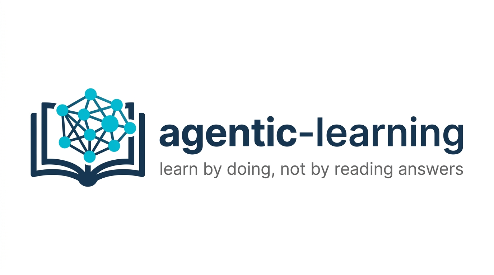
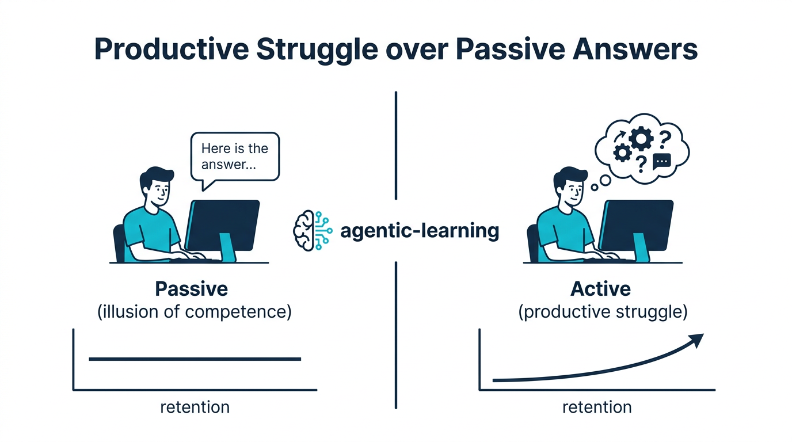
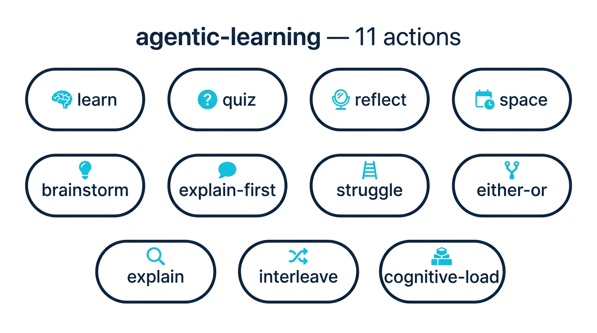
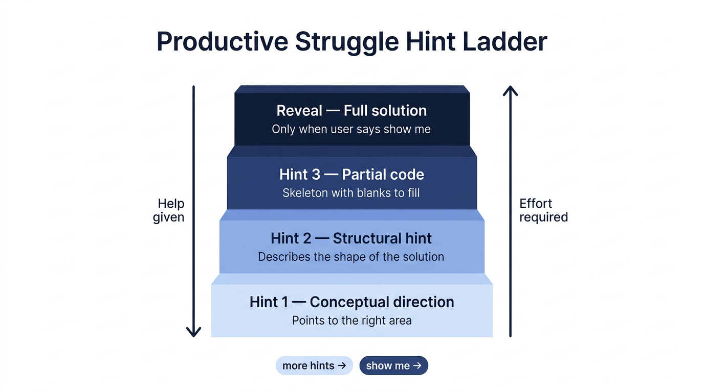

<div align="center">
  
  <br/><br/>
  <p><strong>A learning partner skill for AI coding agents, grounded in neuroscience and philosophy.</strong></p>

  <p>
    <a href="https://github.com/FavioVazquez/agentic-learn/releases"></a>
    <a href="LICENSE"></a>
    <a href="https://agentskills.io/specification"></a>
    <a href="https://skills.sh/FavioVazquez/agentic-learn"></a>
    <a href="CODE_OF_CONDUCT.md"></a>
  </p>

  <p>
    <a href="#installation">Install</a> •
    <a href="#actions">Actions</a> •
    <a href="EXAMPLES.md">Examples</a> •
    <a href="CONTRIBUTING.md">Contributing</a> •
    <a href="CHANGELOG.md">Changelog</a>
  </p>
</div>

---

## Why agentic-learning?

When AI gives you an answer, it *feels* like you've learned. It doesn't mean you have.

Researchers call this the **illusion of competence**: the fluency of reading a well-structured answer is mistaken for actual understanding. Students who re-read notes feel more confident than students who test themselves — but perform significantly worse.



`agentic-learning` makes your AI assistant resist this pattern. Instead of handing over answers, it guides you through four neuroscience-backed techniques that build **real, durable understanding** — while you build real software.

---

## Actions



| Action | Trigger | What it does |
|--------|---------|-------------|
| `learn` | `@agentic-learning learn <topic>` | You explain first; agent corrects and fills the gaps |
| `quiz` | `@agentic-learning quiz` | Retrieval practice on your current file or topic |
| `reflect` | `@agentic-learning reflect` | 3-part structured reflection: learned / goal / gap |
| `space` | `@agentic-learning space` | Schedules concepts to revisit; writes `docs/revisit.md` |
| `brainstorm` | `@agentic-learning brainstorm <idea>` | Design dialogue; writes `docs/brainstorm/YYYY-MM-DD-<topic>.md` |
| `explain-first` | `@agentic-learning explain-first` | You narrate the code before the agent says anything |
| `struggle` | `@agentic-learning struggle <task>` | 3-hint ladder; reveals only when you ask |
| `either-or` | `@agentic-learning either-or <decision>` | Decision journal; appends to `docs/decisions/` |
| `explain` | `@agentic-learning explain` | Reads the project; writes comprehension log to `docs/project-knowledge.md` |
| `interleave` | `@agentic-learning interleave` | Mixed retrieval across multiple topics — the harder, stickier quiz |
| `cognitive-load` | `@agentic-learning cognitive-load <topic>` | Decomposes an overwhelming concept into working-memory-sized steps |

> **Full walkthroughs with realistic conversations for every action:** [EXAMPLES.md](EXAMPLES.md)

> Based on 7 neuroscience-backed techniques — retrieval, spacing, generation, reflection, interleaving, cognitive load management, and metacognition. See [references/learning-science.md](references/learning-science.md) for primary sources including Roediger & Karpicke (2006), Rohrer & Taylor (2007), Sweller (1988), and Lakhani (2021).

---

## The struggle ladder

The `struggle` action uses a 4-level hint system that keeps you in productive struggle as long as possible.



Say `more hints` to advance, or `show me` to skip to the full solution at any point.

---

## Installation

### Option 1 — `npx skills` (easiest)

```bash
npx skills add FavioVazquez/agentic-learn
```

Installs to the current workspace via the [skills CLI](https://skills.sh). Also available at [skills.sh/FavioVazquez/agentic-learn](https://skills.sh/FavioVazquez/agentic-learn).

### Option 2 — `curl` one-liner

```bash
# Workspace (current project only)
curl -fsSL https://raw.githubusercontent.com/FavioVazquez/agentic-learn/main/install.sh | bash

# Global (all projects)
curl -fsSL https://raw.githubusercontent.com/FavioVazquez/agentic-learn/main/install.sh | bash -s -- --global

# Uninstall
curl -fsSL https://raw.githubusercontent.com/FavioVazquez/agentic-learn/main/install.sh | bash -s -- --uninstall
```

### Option 3 — `git clone`

```bash
# Workspace
git clone --depth 1 https://github.com/FavioVazquez/agentic-learn .windsurf/skills/agentic-learning

# Global
git clone --depth 1 https://github.com/FavioVazquez/agentic-learn ~/.codeium/windsurf/skills/agentic-learning
```

### Compatibility

Works with **Windsurf Cascade** and any [AgentSkills-compatible](https://agentskills.io/specification) agent, including Cursor, Copilot, Amp, Cline, Codex, and Gemini CLI.

---

## Files written to your project

When you use this skill, it creates or appends to files in your project — never in the skill directory itself.

```
docs/
├── brainstorm/
│   └── YYYY-MM-DD-<topic>.md         # brainstorm design docs
├── decisions/
│   └── YYYY-MM-DD-decisions.md       # either-or decision journal
├── project-knowledge.md              # explain: growing comprehension log
└── revisit.md                        # space: revisit reminders
```

These files are yours — commit them, use them as documentation, or review them during retrospectives.

---

## The science

Learning requires **productive struggle** — the mental effort that builds real understanding. Nine techniques are proven to work:

| Technique | What it means | Action that uses it |
|-----------|--------------|-------------------|
| **Retrieval** | Recalling from memory beats re-reading | `learn`, `quiz`, `explain-first` |
| **Spacing** | Returning to topics over time beats cramming | `space` |
| **Generation** | Producing an answer (even wrong) builds stronger traces | `learn`, `struggle` |
| **Reflection** | Structured feedback on goals and gaps improves outcomes | `reflect`, `either-or` |
| **Interleaving** | Mixing topics beats studying one topic to exhaustion | `interleave` |
| **Cognitive load** | Working memory is limited — decompose before you explain | `cognitive-load` |
| **Metacognition** | Awareness of *how* you're learning, not just *what* | `reflect`, `learn` |
| **Oracy** | Articulating ideas in your own words surfaces gaps retrieval alone doesn't | `explain-first` |
| **Formative feedback** | Feedback tied to process and goal, not just correct/incorrect | `learn`, `quiz`, `struggle` |

See [references/learning-science.md](references/learning-science.md) for all 9 techniques and primary sources, including *Inadequate* by Priya Lakhani (2021), Hattie & Timperley (2007), and Dweck (2006).

---

## The philosophy behind `either-or`

Kierkegaard's *Either/Or* (1843) argues that every significant choice defines who we are — not just the option chosen, but the act of choosing consciously. Applied to building software with AI agents: every architectural decision, every tradeoff, every "ship it vs. refactor" moment is worth recording. The act of articulating the paths and the rationale is itself learning.

---

## Contributing

Contributions are welcome. Read [CONTRIBUTING.md](CONTRIBUTING.md) for how to add actions, improve existing ones, and what "correct behavior" means for this skill.

- [TESTING.md](TESTING.md) — behavior verification checklist for all 9 actions
- [CHANGELOG.md](CHANGELOG.md) — version history
- [CODE_OF_CONDUCT.md](CODE_OF_CONDUCT.md) — community standards

---

## License

MIT — see [LICENSE](LICENSE)

---

<div align="center">
  <p>Built by <a href="https://github.com/FavioVazquez">Favio Vázquez</a>.</p>
  <p><em>Mental effort is not a flaw in the process. It is the process.</em></p>
</div>
